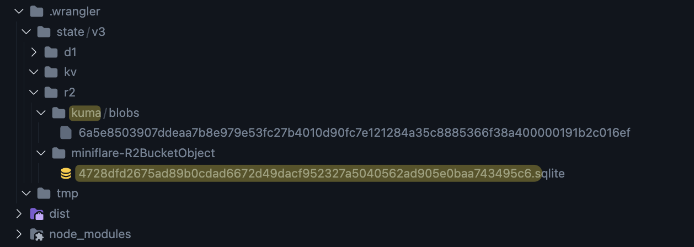

# Cloudflare R2 Dev Server

This is a workaround solution to serve Cloudlflare R2 images when developping locally. Made with [Bun](https://bun.sh/) and [Hono](https://hono.dev/).

Waiting for this feature from wrangler:
https://github.com/cloudflare/workers-sdk/issues/3687

## How to setup?

Clone the repo at the root of your project.

```sh
git clone https://github.com/emilienbidet/cloudflare-r2-dev-server
```

Install dependencies:

```sh
cd cloudflare-r2-dev-server
bun install
```

Setup env variables in a `.env` file, grab them from .wrangler directory :



This is a example `.env` file:

```sh
R2_BUCKET_NAME="kuma"
R2_BUCKET_DABASE_NAME="4728dfd2675ad89b0cdad6672d49dacf952327a5040562ad905e0baa743495c6"
R2_BUCKET_PATH="../.wrangler/state/v3/r2/"
PORT="3000" # optional
```

Start the server

```sh
bun run start
```

Test it by uploading a image to the bucket and by trying access it with http://localhost:3000/:key

🎉 Bravo! All your uploaded r2 images when developping locally are now available from http://localhost:3000/:key

## Optional

Add `cloudflare-r2-dev-server/` to your `.gitignore` file

Add `cloudflare-r2-dev-server` to your `tsconfig.json` file
```json
{
 "exclude": [
    "node_modules",
    "dist",
    "cloudflare-r2-dev-server"
  ]
}
```
